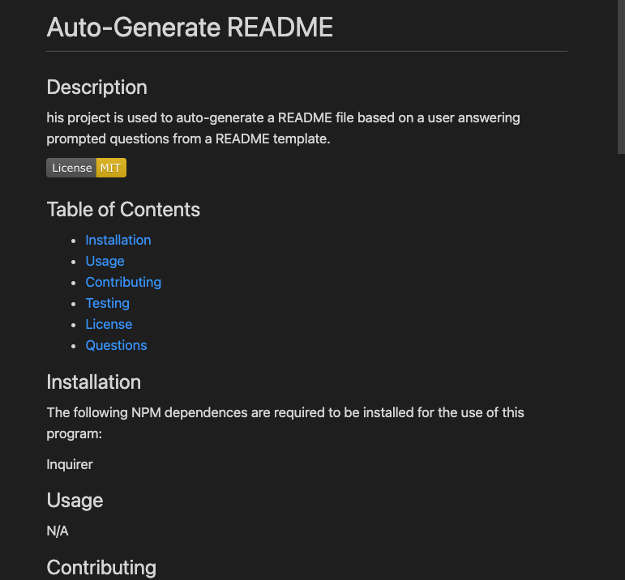

    
# Auto-Generate README

## Description
This project is used to auto-generate a README file based on a user answering prompted questions from a README template. This project used the Inquirer NPM to generate the questions for the README information. Then, using the user inputted responses, a markdown file is created in a fully formatted function for the user's convenience.

## Table of Contents
* [Installation](#installation)
* [Usage](#usage)
* [Contributing](#contribution)
* [Testing](#testing)
* [License](#license)
* [Questions](#questions)

## Installation
The following NPM dependences are required to be installed for the use of this program: 

* Inquirer 

## Usage
Execute the application using node ./index.js. After answering all the prompted questions/statements, your end product should have something similar to the below image:

A demonstration of using this application can be found here: https://drive.google.com/file/d/1LwADZH_9Qcz3wnc4x-lwSLvm7TfnfKb7/view?usp=sharing.

## Contributing 
Feedback for the project is appreciate. Feel free to use the coding for generating your README files!

## Testing
No testing is required for this project. 

## License
MIT License

        Copyright (c) 2021 Arthur Leung
        
        Permission is hereby granted, free of charge, to any person obtaining a copy
        of this software and associated documentation files (the "Software"), to deal
        in the Software without restriction, including without limitation the rights
        to use, copy, modify, merge, publish, distribute, sublicense, and/or sell
        copies of the Software, and to permit persons to whom the Software is
        furnished to do so, subject to the following conditions:
        
        The above copyright notice and this permission notice shall be included in all
        copies or substantial portions of the Software.
        
        THE SOFTWARE IS PROVIDED "AS IS", WITHOUT WARRANTY OF ANY KIND, EXPRESS OR
        IMPLIED, INCLUDING BUT NOT LIMITED TO THE WARRANTIES OF MERCHANTABILITY,
        FITNESS FOR A PARTICULAR PURPOSE AND NONINFRINGEMENT. IN NO EVENT SHALL THE
        AUTHORS OR COPYRIGHT HOLDERS BE LIABLE FOR ANY CLAIM, DAMAGES OR OTHER
        LIABILITY, WHETHER IN AN ACTION OF CONTRACT, TORT OR OTHERWISE, ARISING FROM,
        OUT OF OR IN CONNECTION WITH THE SOFTWARE OR THE USE OR OTHER DEALINGS IN THE
        SOFTWARE.

## Questions
* If you have questions regarding this program, please contact arthur.leung3@gmail.com.

* If you have questions regarding the repository in general or would like to see more of my work, please see https://github/com/Artydabomb/.

    
